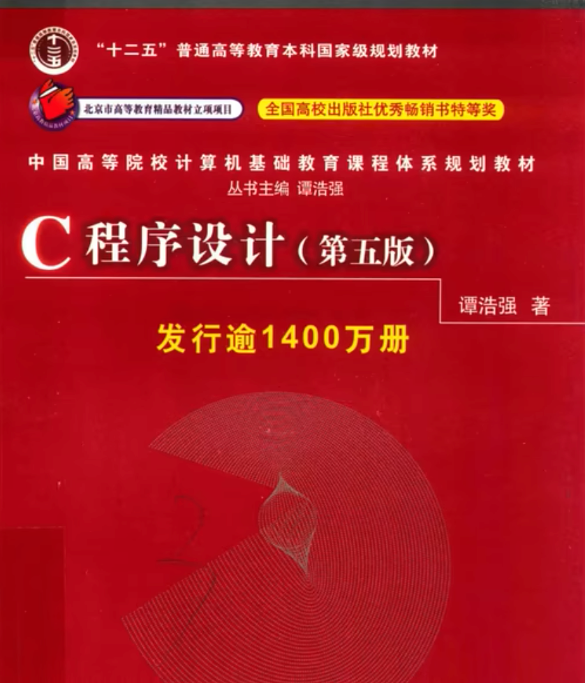

## 一、C语言程序设计

### 1.1 C语言入门

浙江大学翁恺教授的视频，目前开课时间已经过了，需要等到年后2月26日开课之后可以看（免费）：https://www.icourse163.org/course/ZJU-199001?tid=1472097508

中国大学mooc网站上有很多名校老师的课程，而且免费，唯一的缺点是课程基本上是按照学生上课的节奏开的课，所以关闭课程之后就看不了了。

我在B站找到了录播：https://www.bilibili.com/video/BV1dr4y1n7vA/?spm_id_from=333.337.search-card.all.click&vd_source=3ada60422344c7a7d19b03c6d74b13f6

个人觉得C入门的话看视频之后，再去看书更合适

书籍推荐，可以去网上找prd版或者买二手书：

### 1.2 C语言进阶

也是翁恺教授的课程：https://www.icourse163.org/course/0809ZJU007B-200001?outVendor=zw_mooc_pclszykctj_

如果已经关课了，可以看B站录播：https://www.bilibili.com/video/BV1Hs411A7NS/?spm_id_from=333.337.search-card.all.click

书籍推荐，这两本如果从0开始啃完，会很花时间，如果是爱好的话可以看完，如果仅仅是学来用，可以当作工具书，查漏补缺，基本上看完视频，就能理解指针内存的概念了，如果后续要写c，建议可以啃完：

## 二、操作系统

### 2.1操作系统入门

中国大学mooc平台视频课程：https://www.icourse163.org/course/NJTU-1003245001?from=searchPage&outVendor=zw_mooc_pcssjg_

B站上的这个质量也很高：https://www.bilibili.com/video/BV1mB4y1y7Gs/?spm_id_from=333.337.search-card.all.click&vd_source=3ada60422344c7a7d19b03c6d74b13f6

入门书籍推荐：《**操作系统**导论》 强烈**推荐**，国外经典教材《Operating Systems:Three Easy Pieces》的中文版

导论就是讲的大而全，但是不深入，主要就是先构建一个系统框架出来。计算机到底是要学什么、研究什么内容。

### 2.2操作系统进阶

## 三、数据结构与算法

课程：https://www.bilibili.com/video/BV11T411q7Qw/?spm_id_from=333.337.search-card.all.click&vd_source=3ada60422344c7a7d19b03c6d74b13f6

课程配套书籍(计算机考研也是用的这本书，清华大学的)：

推荐书籍：《大话数据结构》

## 四、面向对象的程序设计

这里就可以学java、python、C++的其中一种了，都是面向对象的程序设计，前面C语言是面向过程的程序设计，不足以支撑庞大系统的应用层面设计。这里可以去学python、C++的话比较麻烦的一个点是指针的概念依旧贯穿始终，Java是不需要关注指针的，难度相对于C++会容易一些，现在大型应用类系统主流还是Java开发，大型的编辑器系统，就是开发各种工具给程序员呀、设计工程师用的软件是用C++开发，性能更优。因为我主流是java，所以给你推荐的是java相关的路线。这里先简约推荐，等你学完前面三部分之后，如果对java感兴趣我可以再展开。

### 4.1 Java入门与进阶

视频课程同样也是翁恺教授的：https://www.icourse163.org/course/0809ZJU013-1001541001?outVendor=zw_mooc_pclszykctj_

B站录播：https://www.bilibili.com/video/BV1wL411L7A3/?spm_id_from=333.337.search-card.all.click

书籍推荐：

java其实内容并不多也不难，其实难点在于它其实只是编写应用级项目的基础，在java的基础上，需要用到很多的框架技术，中间件技术结合起来去完成项目开发。

### 4.2 Java框架技术

我们常说前端、后端，实际上在刚出现java的时候，并没有前后端之分，前后端的代码是在一起的，但是后来会发现这种项目管理上维护很复杂，可移植性并不强。例如现在PC和移动端页面针对之前的不分离模式，需要开发两套。那时候后端是java，前端使用的jsp。不过这些东西现在都过时了，去了解它们其实可以更能理解现在为什么分了前后端。以及一些框架技术的演变。到底方便在哪里。‘

框架视频可以直接在B站上搜索，黑马程序员/尚硅谷的视频，两者就看你更习惯哪个老师讲课说话节奏吧，本质上差不多。

#### 4.2.1 Spring框架

书籍推荐：

**《Spring 5 核心原理 与 30个类手写实战》** 谭永德 著

#### 4.2.2 SpringBoot框架

书籍推荐：

#### 4.2.3 Mybatis框架、MybatisPlus框架

需要先学习**mysql**的相关知识

先理解Mybatis框架，再去快速看官方文档学习使用MybatisPlus框架，也只需要看课程视频就行，这个其实不太需要很多时间学习，只要会用就行。

### 4.3 其他

做项目还需要学习前端，现在用的比较多的是vue前端框架、ajax(前后端请求数据的桥梁)，这些B站都有很多现成视频。可以找一个小的项目例子，去跟着学习做出来。

学习java之外还需要学习一些中间件，例如dubbo、rabbitMQ、XXLJob等，还包括tomcat、redis、docker等等。这些东西其实知道基本原理，然后会看文档使用就可以了，可以理解为它们都是帮助项目的一些工具。

这部分就介绍的比较简单，如果后面对java方向感兴趣我在细说，也有可能你会选择python呀、go语言。

